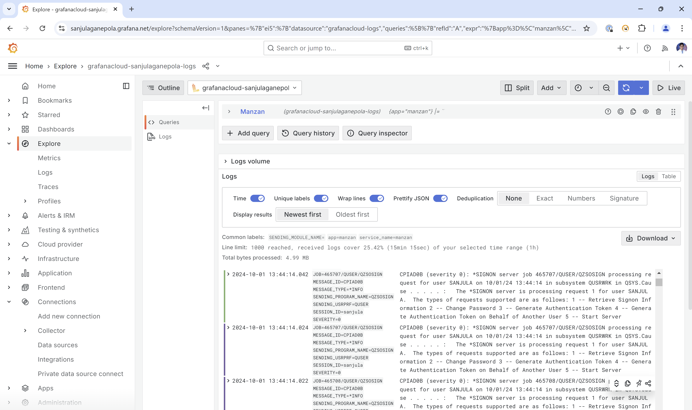
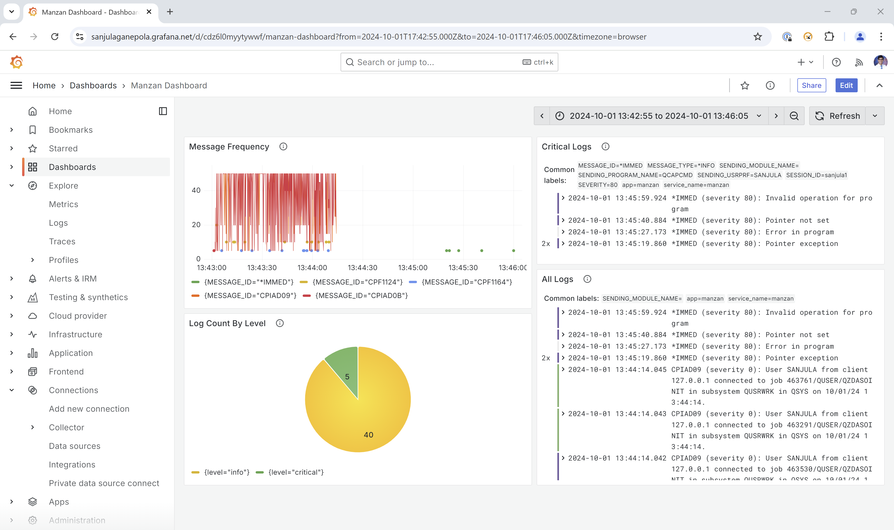

# Grafana Loki

This example shows how to use `loki` as a destination for a `watch` data source.

## Configuration

Be sure to have read up on [Manzan configuration](/config/index.md) to understand where these files exist on your system.

### `data.ini`

```ini
type=watch
id=sanjula
destinations=loki_out
format=$MESSAGE_ID$ (severity $SEVERITY$): $MESSAGE$
strwch=WCHMSG((*ALL)) WCHMSGQ((*HSTLOG))
```

### `dests.ini`

```ini
[loki_out]
type=loki
url=<loki_url>
username=<loki_username>
password=<loki_password>
```

## Result

<div style="text-align: center; margin: 20px;">
    
    
</div>