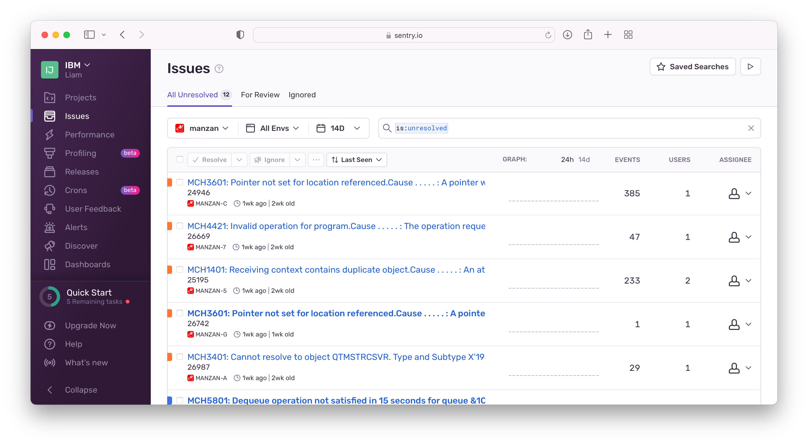
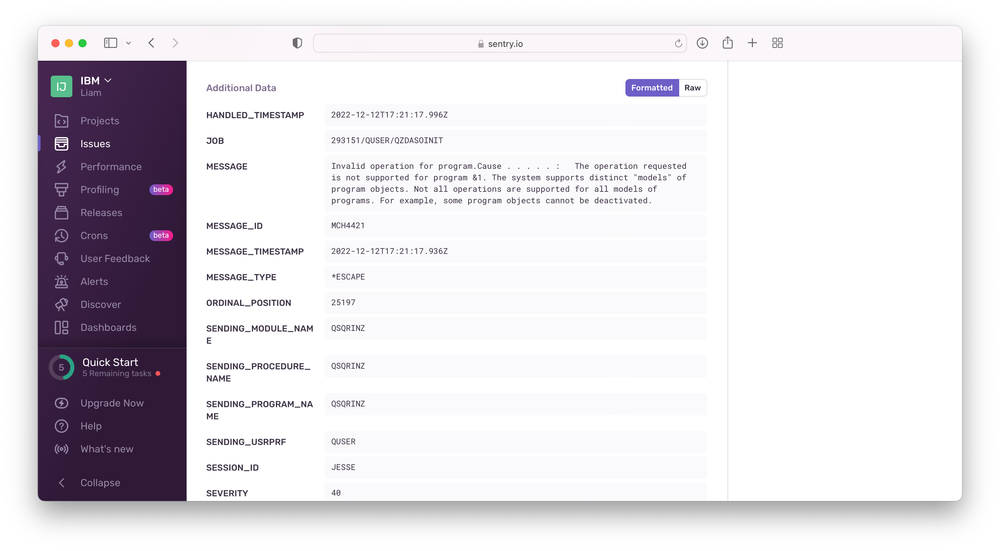

This example shows how to use `sentry` as a destination for a `watch` data source

## Configuration

Be sure to have read up on [Manzan configuration](/config/index.md) to understand where this files exist on your system.

### `data.ini`

```ini
[watchout]
type=watch
id=jesse
destinations=sentry_out
# will automatically start and stop the watch
strwch=WCHMSG((*ALL)) WCHMSGQ((*HSTLOG))
```

### `dests.ini`

```ini
[sentry_out]
type=sentry
dsn=<sentryDSN>
```

## Result



