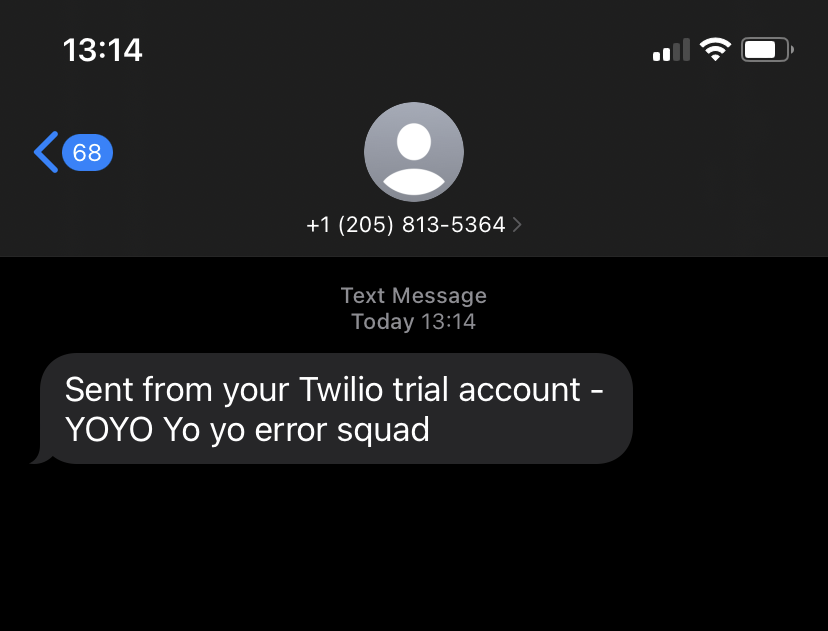

# Twilio

This example shows how to use `twilio` as a destination.

## Configuration

Be sure to have read up on [Manzan configuration](/config/index.md) to understand where these files exist on your system.

### `data.ini`

```ini
[input_file]
# where the data is coming from (it's a camel route)
type=file
# camel route attributes
file=test.txt
# as defined in dests.ini
destinations=test_out,twilio_spam
# filter is optional. only logs messages that contain this value
filter=error
# format is also optional. logs FILE_DATA as-is if not provided
format=YOYO $FILE_DATA$
```

### `dests.ini`

```ini
[test_out]
# the camel out. stdout is a manzan special baby
type=stdout

[twilio_spam]
type=twilio

# These come from a Twilio account
sid=x
token=x

to=...
from=+12058135364
```

##  Result

